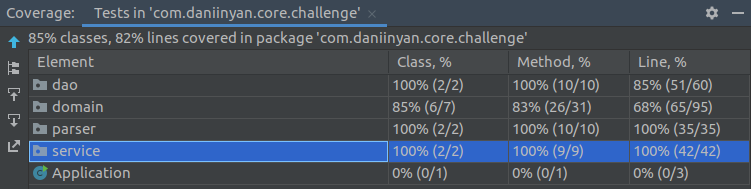

# Core Challenge
Final challenge from ilegra's Core Engineering 2019.2 trail.

---
### Summary:
- What is this?
- How it works?
- Architecture
- Future features
- Final considerations
---

## What is this?
This is a data analysis system. It's able to read a lot of specific flat files, analyse the data and output a report. 

## How it works?
This system reads all `.dat` files from `/data/in` folder. 
The files must be in one of the three following format:
 

Salesman data: id 001  
- `001çCPFçNameçSalary`

Customer data: id 002  
- `002çCNPJçNameçBusiness Area`

Sales data: id 003  
- `003çSale IDç[Item ID-Item Quantity-Item Price]çSalesman name`

The system support almost every delimiter including `ç`. Feel free to test it with another one like `/`, `-` or anyone you prefer.

---
There is a `Watcher` class inside the system. 
This class listen every change in `data/in` folder, analyse its data and write a report in `data/out` folder with:
- Amount of customers;
- Amount of sellers;
- ID from most expensive sale;
- Name of worst salesman;

To work correctly, the `data_analysis.done.dat` file must already exist in `data/out` folder. 
Otherwise, it'll be necessary run and stop the system one time to create the file.

This file is updated every time a change occurs inside `data/in` folder. 

## Architecture
This system has four modules:  
- DAO: to read input file and write the output;
- Service: to process data from DAO, analyse and return a result;
- Parser: to help Service parse Strings from DAO to system's objects;
- Domain: to represent and manager system's contents;

`Application` is the Main class. It starts a `Watcher` thread.  
`Watcher` is responsible for listen `data/in` folder and call `DataAnalyzer` whenever the folder has a change.  
`DataAnalyzer` updates the report inside `data/out`folder.

The system was built using TDD and has 85% test coverage.

## Future features
- Create report file in runtime;
- Support escaped delimiters;
- Test with a mock framework;

## Final considerations
This was the final challenge from ilegra's Core Engineering 2019.2 trail. 
All participants had four days (24 work hours) to do it individually. 
